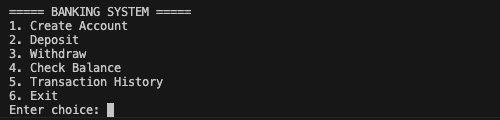
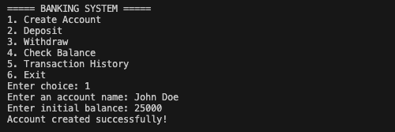

# Banking System Simulation

A lightweight, interactive command-line quiz application built with Python. It helps practice core Python concepts by simulating basic banking operations such as account creation, deposits, withdrawals, balance checking, and transaction history management.

---

## Features

- Create new bank account
- Deposit money
- Withdraw money
- Check account balance
- View transaction history
- Prevent withdrawal beyond available balance
- Persistent data storage using JSON
- Error handling for invalid inputs

---

## Tech Stack

- Python 3
- JSON (for data storage)
- File Handling
- CLI (Command Line Interface)
- Built-in modules

---

## Project Structure

```bash
banking-system/
├── assets/
├── data/
│   └── accounts.json
│
├── src/
│   └── main.py
│
├── README.md
└── requirements.txt
```

## How It Works

- User interacts through a CLI menu
- Users can create a new bank account by entering:
  - Account holder name
  - Initial balance
- Each account stores:
  - Name
  - Current balance
  - Transaction history
- Users can perform:
  - Deposit operations
  - Withdrawal operations
  - Balance checking
  - Transaction history viewing
- The system prevents withdrawals when balance is insufficient
- All account data is stored inside accounts.json
- Changes are saved permanently using JSON file storage

## How to Run:

1. Clone the Repository:

```bash
git clone https://github.com/Saurav-T/Python-Mini-Projects
```

2. Navigate to Project Folder:

```bash
cd Python-Mini-Projects/beginner-projects/banking-system-simulation
```

3. Run the Program:

```bash
python src/main.py
```

## Screenshots

### Main Menu



### Create Account



### Withdraw


### Transaction History


## Future Improvements

- Unique account number generation
- PIN-based account security
- SQLite database integration
- Interest calculation system
- Loan management feature

## Learning Outcomes

- File handling in Python
- Working with JSON
- Functions and modular code
- CLI application design

### Author

- Saurav Tamrakar
- GitHub: [Saurav-T](https://github.com/Saurav-T)
