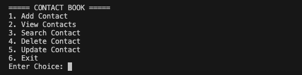
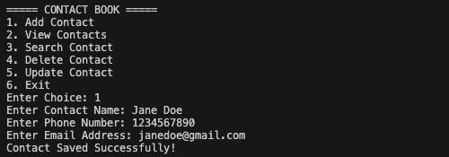
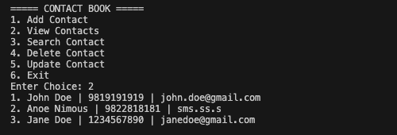
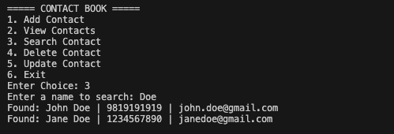

# Contact Book CLI Application

A simple Python-based Contact Book application that allows users to manage contacts using JSON file storage.

---

## Features

- Add new contact
- View all saved contacts
- Search contact by name
- Delete contact
- Update existing contact
- Prevent duplicate phone numbers
- Prevent duplicate email addresses
- Persistent data storage using JSON

---

## Tech Stack

- Python 3
- JSON (data storage)
- File Handling
- CLI (Command Line Interface)

---

## Project Structure

```bash
contact-book/
│
├── assets
│   └── screenshots
├── data/
│   └── contacts.json
│
├── src/
│   └── main.py
│
├── README.md
└── requirements.txt
```

---

## How It Works

- User interacts through a CLI menu
- Contacts can be added by entering:
  - Name
  - Phone Number
  - Email Address
- Each contact is validated before saving:
  - Duplicate phone numbers are not allowed
  - Duplicate email addresses are not allowed
- All contact data is stored inside contacts.json
- Users can:
  - View all saved contacts
  - Search contacts by name
  - Update existing contact details
  - Delete contacts when no longer needed
- Changes are saved permanently using JSON file storage, so data remains available after closing the program

## How to Run:

1. Clone the Repository:

```bash
git clone https://github.com/Saurav-T/Python-Mini-Projects.git
```

2. Navigate to Project Folder:

```bash
cd Python-Mini-Projects/beginner-projects/contact-book
```

3. Run the Application:

```bash
python src/main.py
```

## Screenshots

### Main Menu



### Add Contact



### View Contacts



### Search Contacts



## Future Improvements

- Add Flask/Django web version
- Add Export contacts to CSV
- Add Contact categories (Family, Work, Friends)
- Add Profile picture support
- Add Login authentication

## Learning Outcomes

- File handling in Python
- Working with JSON
- Functions and modular code
- CLI application design

### Author

- Saurav Tamrakar
- GitHub: [Saurav-T](https://github.com/Saurav-T)
