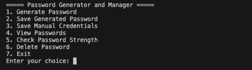
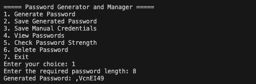
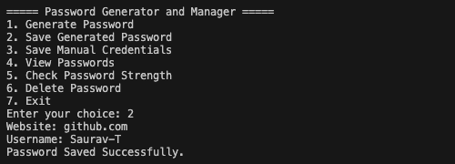
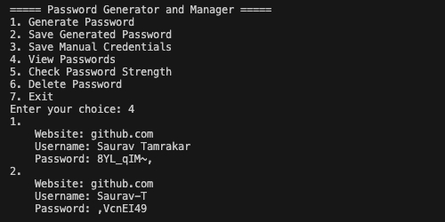

# Password Generator and Manager Application

A command-line Password Manager built using Python that allows users to generate, store, and manage passwords using encryption and local JSON storage.

---

## Features

- Generate strong random passwords
- Save passwords securely using encryption (Fernet)
- Save manual credentials (website, username, password)
- View saved passwords (auto-decrypted)
- Delete saved credentials
- Check password strength
- Persistent storage using JSON file

---

## Tech Stack

- Python 3
- JSON (data storage)
- File Handling
- Cryptography (Fernet encryption)
- CLI (Command Line Interface)

---

## Project Structure

```bash
password-generator/
├── data
│   └── passwords.json
├── src
│   ├── main.py
│   └── keygen.py
├── assets
│   └── screenshots
├── key.key
├── README.md
└── requirements.txt
```

---

## How It Works

- User interacts through a CLI menu
- Passwords are either:
  - Generated automatically, or
  - Entered manually
- All passwords are encrypted using Fernet before saving
- Encrypted data is stored in passwords.json
- On viewing, passwords are decrypted in real time
- Key file (key.key) is used for encryption/decryption

## How to Run:

1. Clone the Repository:

```bash
git clone https://github.com/Saurav-T/Python-Mini-Projects.git
```

2. Navigate to Project Folder:

```bash
cd Python-Mini-Projects/beginner-projects/password-generator
```

3. Create Virtual Environment:

```bash
python -m venv venv
```

4. Activate Virtual Environment:

```bash
source venv/bin/activate
```

5. Install dependencies:

```bash
pip install -r requirements.txt
```

6. Generate Encryption Key (First Time Only):

```bash
python src/keygen.py
```

7. Run the Application:

```bash
python src/main.py
```

## Screenshots

### Main Menu



### Generate Password



### Save Generated Password



### View Passwords



## Future Improvements

- Add search by website
- Add clipboard copy feature
- Add master password login
- Add SQLite database instead of JSON
- Add GUI version (Tkinter or PyQt)

## Learning Outcomes

- File handling in Python
- Working with JSON
- Functions and modular code
- CLI application design
- Symmetric encryption (Fernet)

### Author

- Saurav Tamrakar
- GitHub: [Saurav-T](https://github.com/Saurav-T)
