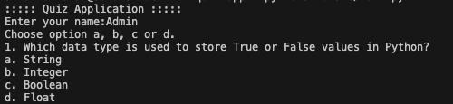
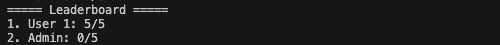
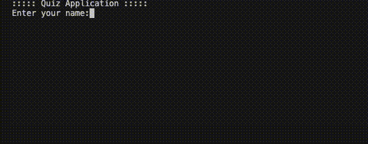

# Quiz Command Line Interface Application

A lightweight, interactive command-line quiz application built with Python. It supports timed questions, randomized quizzes, and a persistent leaderboard system using JSON storage.

---

## Features

- Timed Quiz (5 seconds per question)
- Randomized question order each session
- Score tracking system
- User-based scoring (name input)
- Persistent leaderboard (stored in JSON)
- File-based data storage (no database required)

---

## Tech Stack

- Python 3
- JSON (for data storage)
- File Handling
- CLI (Command Line Interface)
- Built-in modules

---

## Project Structure

```bash
quiz-app/
├── assets/
├── data/
│   ├── leaderboard.json
│   └── questions.json
├── src/
│   └── main.py
├── README.md
└── requirements.txt
```

## How It Works

- Loads questions from questions.json
- Shuffles questions randomly
- Prompts user for name
- Displays each question with multiple-choice options
- Gives a 5-second timer per question
- Calculates score based on correct answers
- Saves result to leaderboard
- Displays ranked leaderboard

## How to Run:

1. Clone the Repository:

```bash
git clone https://github.com/Saurav-T/Python-Mini-Projects
```

2. Navigate to Project Folder:

```bash
cd Python-Mini-Projects/beginner-projects/quiz-app
```

3. Run the Program:

```bash
python src/main.py
```

## Screenshots

### Question



### Leaderboard



### Quiz App Flow



## Future Improvements

- Cross-platform timer using threading
- GUI version (Tkinter / PyQt)
- Difficulty levels
- Database integration (SQLite)
- REST API version using Flask

## Learning Outcomes

- File handling in Python
- Working with JSON
- Functions and modular code
- CLI application design

### Author

- Saurav Tamrakar
- GitHub: [Saurav-T](https://github.com/Saurav-T)
