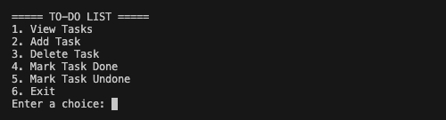
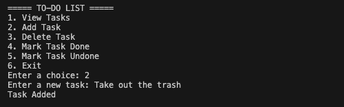
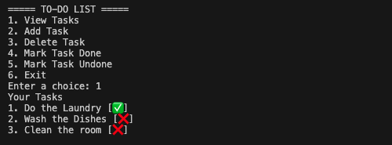
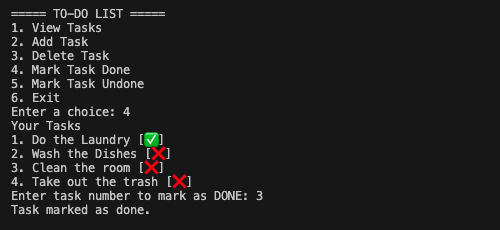

# To-Do List Command Line Interface Application

A command-line To-Do List application built using Python that allows users to manage daily tasks with persistent JSON storage.

---

## Features

- Add new tasks
- View all tasks
- Delete tasks
- Mark tasks as done/undone
- Persistent storage using `tasks.json`

---

## Tech Stack

- Python 3
- JSON (for data storage)
- File Handling
- CLI (Command Line Interface)

---

## Project Structure

todo-list/
│
├── data/
│ └── tasks.json
│
├── src/
│ └── main.py
│
├── assets/
│ └── screenshots/
│
├── README.md
└── requirements.txt

## ⚙️ How It Works

- User interacts through a command line menu
- Tasks are stored in a JSON file (`data/tasks.json`)
- Each task contains:
  - title
  - completion status (done / undone)
- Data is loaded when the program starts and saved after every change

## How to Run:

1. Clone the Repository:
```bash
git clone https://github.com/Saurav-T/Python-Mini-Projects
```

2. Navigate to Project Folder:
```bash
cd todo-list
```

3. Run the Program:
```bash
python src/main.py
```

## Screenshots

### Main Menu


### Add Task


### View Tasks


### Mark Task as Done


## Future Improvements
- Add priority levels
- Add due dates
- Add search functionality
- Add GUI version (Tkinter)
- Add database support

## Learning Outcomes
- File handling in Python
- Working with JSON
- Functions and modular code
- CLI application design

### Author
- Saurav Tamrakar
- GitHub: [Saurav-T](https://github.com/Saurav-T)